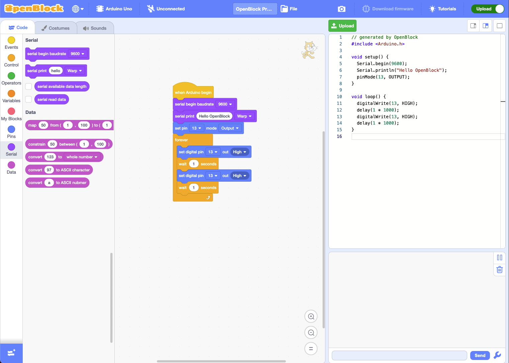

# ThingEduBlock Desktop | By ThingEdu - Rogo Solutions

## Introduction

ThingEduBlock Desktop is a low-code programming IDE desktop application for the ThingEduBlock platform. It is a visual programming tool that allows users to create programs for ThingEdu Board by connecting blocks together. It is designed to be easy to use and accessible to beginners, while also being powerful enough for advanced users.

This application is still in the early stages of development, and is not yet ready for general use. However, we are actively working on it and will be releasing updates regularly. If you are interested in trying it out, please connect with us for more information.

## Screenshots

